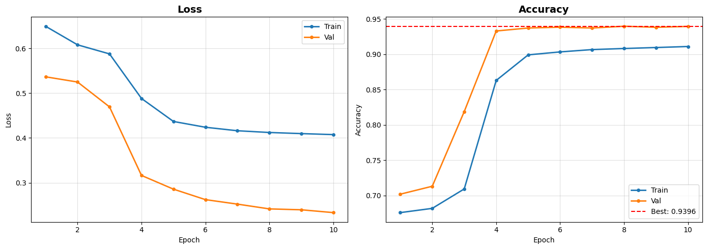
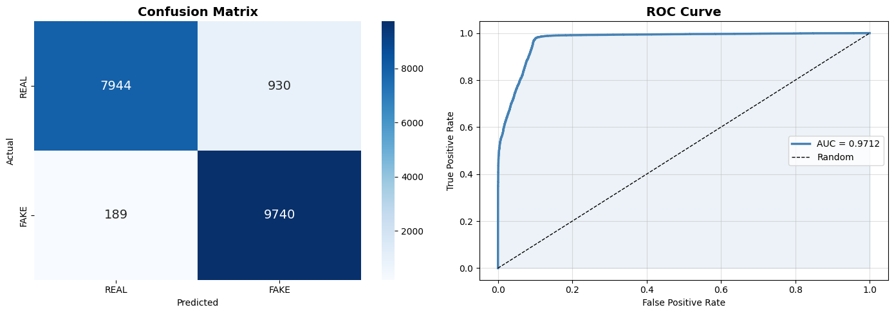
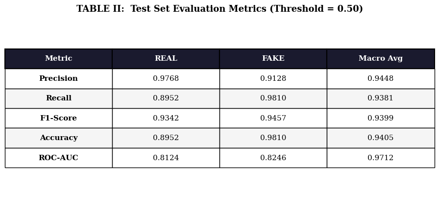
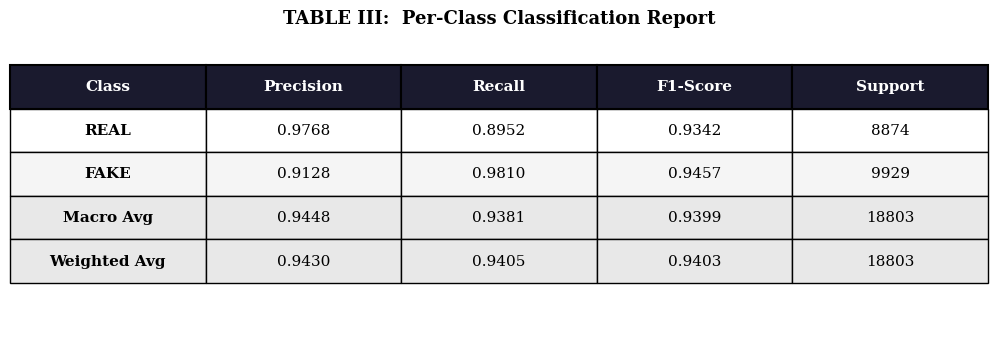
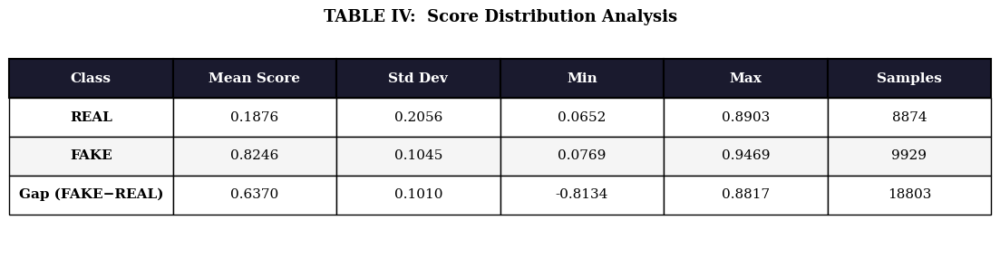
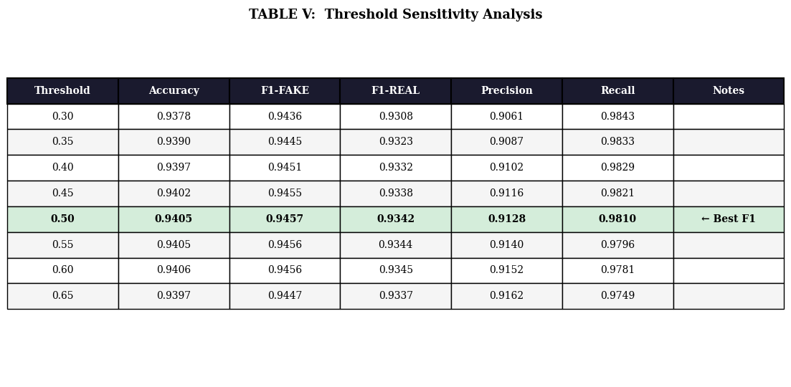
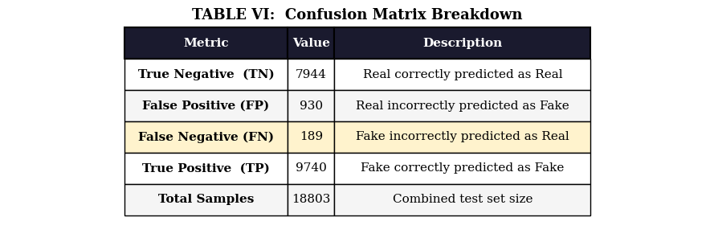

# 🔍 Multi-Branch Deepfake Detection System

> Deep Learning model for detecting AI-generated fake images using 
> a 4-branch parallel CNN architecture with Attention Gate.

---

## 📋 Project Overview

This project implements a **Multi-Branch Deepfake Detection System** 
that detects fake images using generation-level forgery traces 
including FFT artifacts, edge inconsistencies, semantic features, 
and acquisition traces.

### Key Results

- Accuracy: 94.05%
- ROC-AUC: 97.12%
- Macro F1-Score: 93.99%
- Four-Branch CNN + Attention Gate Architecture

---

**Developed by:**

- Krish Yadav
- Pranjal Seluriyal
- Isha

**Institution:** School of Computer Science, UPES Dehradun

---

## 🏗️ Model Architecture


---

## 📊 Results

| Metric | REAL | FAKE | Macro Avg |
|----------|----------|----------|----------|
| Precision | 0.9768 | 0.9128 | 0.9448 |
| Recall | 0.8952 | 0.9810 | 0.9381 |
| F1-Score | 0.9342 | 0.9457 | 0.9399 |
| Accuracy | 0.8952 | 0.9810 | 0.9405 |
| ROC-AUC | 0.8124 | 0.8246 | 0.9712 |

**Best Threshold: 0.50**

---

## 📁 Datasets Used

| Dataset | Modality | Purpose |
|---|---|---|
| 140k Real and Fake Faces | Image | StyleGAN fake faces |
| FaceForensics++ | Image/Video | 6 manipulation methods |
| CelebA | Image | Diverse real faces |
| CiFAKE (or CIPLAB Real and Fake Face Detection) | Image | Additional diversity |

---

### Feature Branches

1. RGB Branch – Semantic facial features
2. FFT Branch – Frequency-domain artifacts
3. Edge Branch – Boundary inconsistencies
4. Acquisition Branch – Camera and generation traces

---

## 🔧 Tech Stack

- **Framework:** PyTorch
- **Language:** Python 3.8+
- **Platform:** Kaggle (GPU T4 x2)
- **Key Libraries:** PyTorch, OpenCV, NumPy, scikit-learn, Matplotlib, Pandas

---

## 🚀 How to Run

### On Kaggle
1. Open the notebook on Kaggle
2. Add datasets:
   - 140k Real and Fake Faces
   - FaceForensics++ (ff-c23)
   - CelebA Dataset
   - Real and Fake Face Detection (ciplab)
3. Enable GPU (T4 x2)
4. Run all cells

### Local Installation

```bash
git clone <repo-url>
cd deepfake-detection
pip install -r requirements.txt
```

---

### Inference on Single Image
```python
predict_my_image("path/to/image.jpg", threshold=0.50)
```

---

## 📈 Training Curves



---

## 📊 Evaluation Plots



---

## 📋 Evaluation Tables







---

## 🏛️ Project Structure

```text
deepfake-detection/
├── deepfake-detection.ipynb
├── requirements.txt
├── README.md
└── assets/
```

## 📚 References

1. Y. Ma et al., "Deep learning technology for face forgery 
   detection: A survey," Neurocomputing, 2024.
2. A. Rossler et al., "FaceForensics++: Learning to Detect 
   Manipulated Facial Images," ICCV, 2019.
3. B. Dolhansky et al., "The DeepFake Detection Challenge 
   Dataset," arXiv:2006.07397, 2020.
